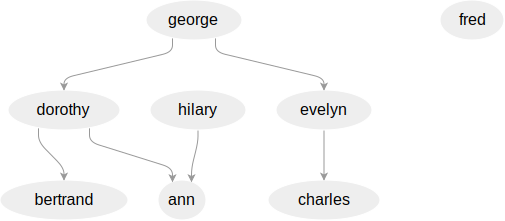

# Examples from 'What You Always Wanted to Know About Datalog'

...*(And Never Dared to Ask)*

A couple Datomic-flavored Datalog examples from the [classic 1989 paper](https://www2.cs.sfu.ca/CourseCentral/721/jim/DatalogPaper.pdf) by Stefano Ceri, Georg Gottlob, and Letizia Tanca.

Used as tiny demonstrations of Datomic syntax for simple queries involving rules and recursion.

